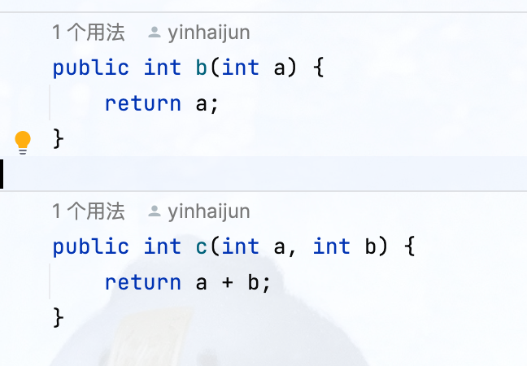
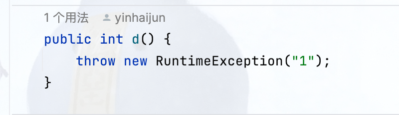
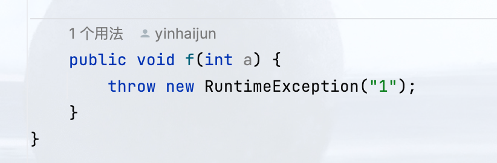
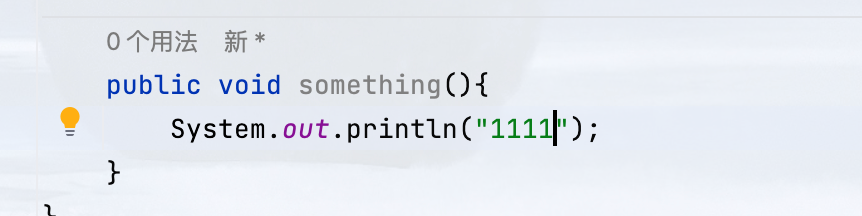

# ACTest
Auto Create Java Test 

## 有返回值

### 有入参

例：

针对有返回值，且有入参的情况，我们应该关注<u>**入参**</u>的类型和**<u>返回值</u>**的类型，即对入参进行数据模拟，以及针对返回值进行校验

入参数为基本类型的时候可以使用默认值进行赋值

~~原想法~~（已废弃⚠️）

```
    hai_int("int", 1),
    hai_string("String", "a"),
    hai_short("short", 1),
    hai_boolean("boolean", true),
    hai_byte("byte", 1),
    hai_char("char", 'a'),
    hai_float("float", 0.1f),
    hai_double("double", 1.1d),
    hai_long("long", 1L);
```

新想法（new 💡）

```
使用JMockData进行入参的构建
git参考地址：https://github.com/jsonzou/jmockdata
```


### 无入参

例：

## 无返回值

### 有入参

例：

### 无入参

例：